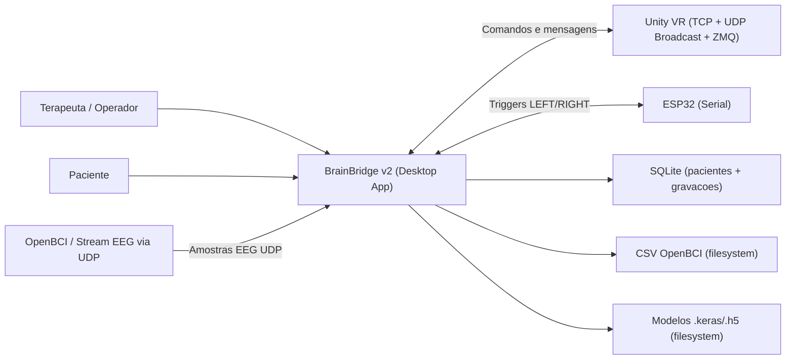
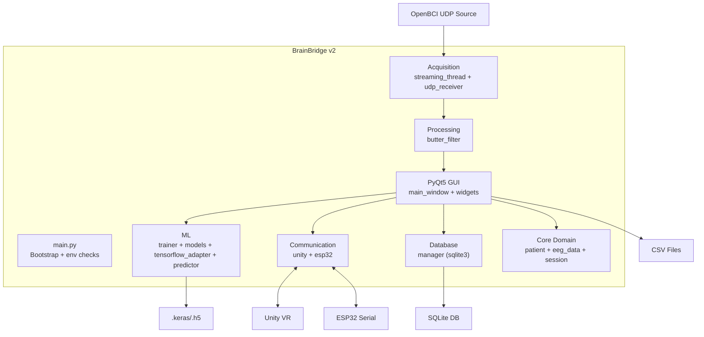
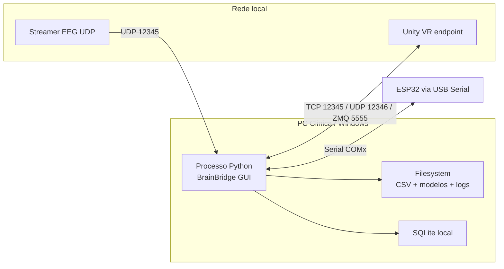
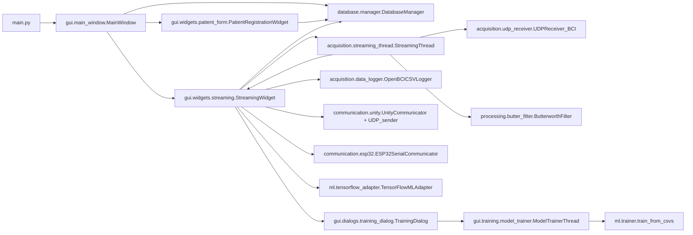
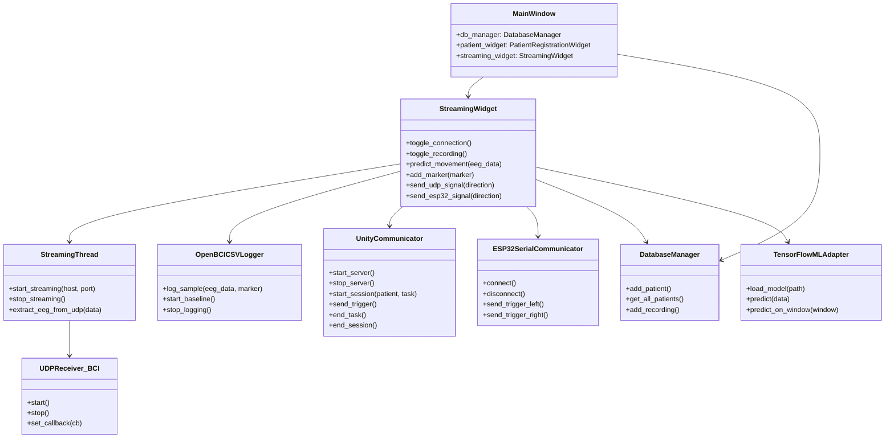
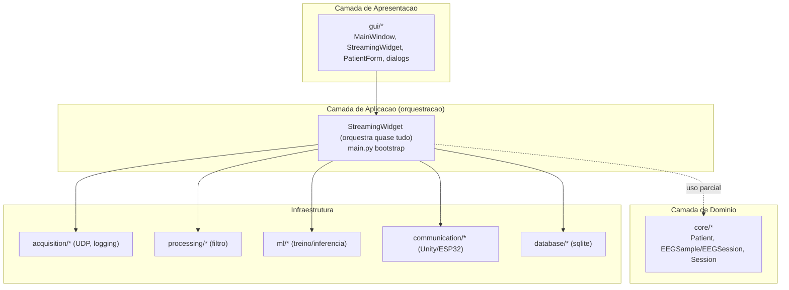
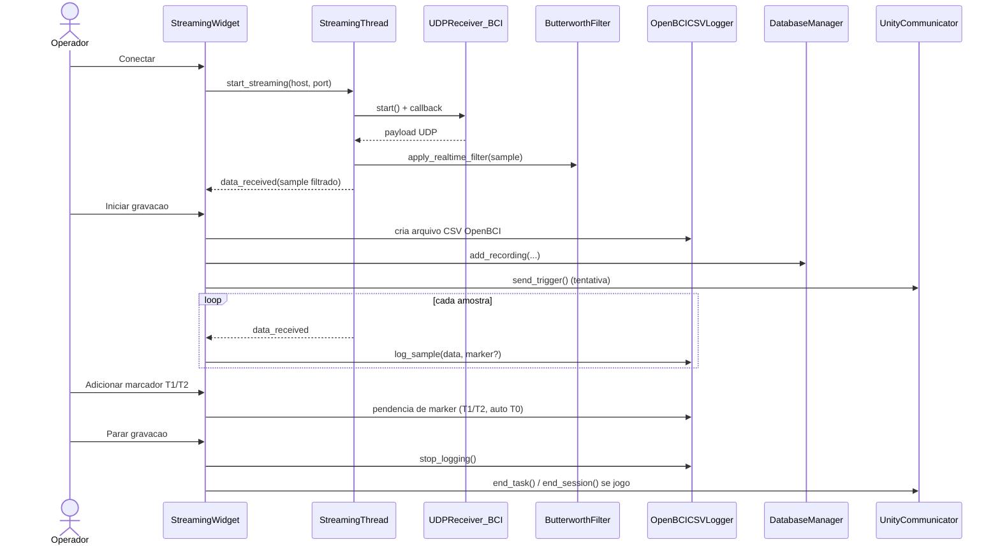
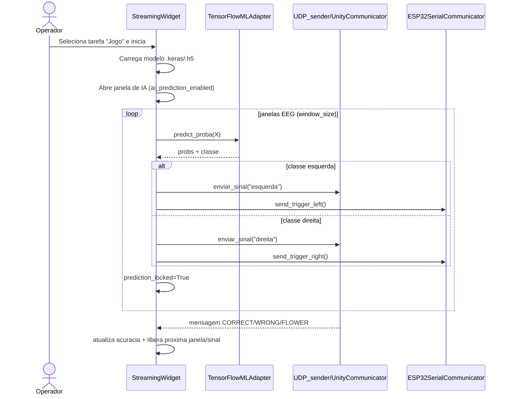
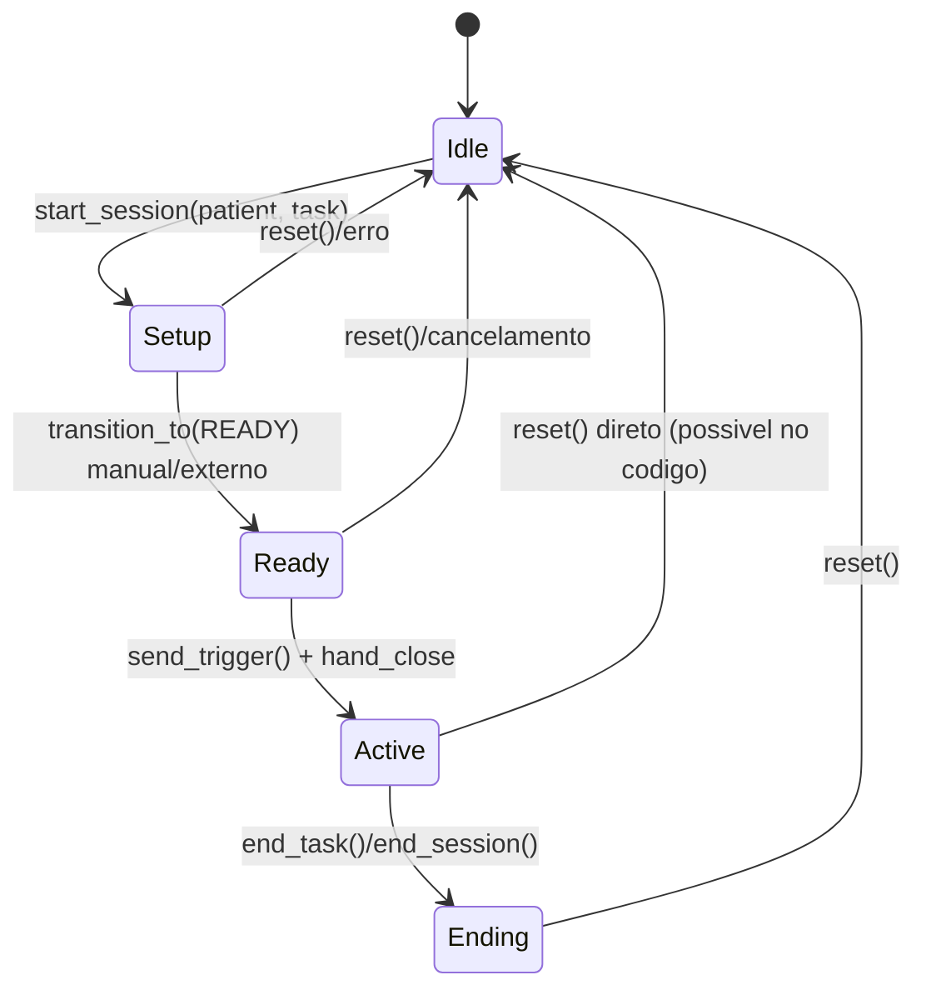
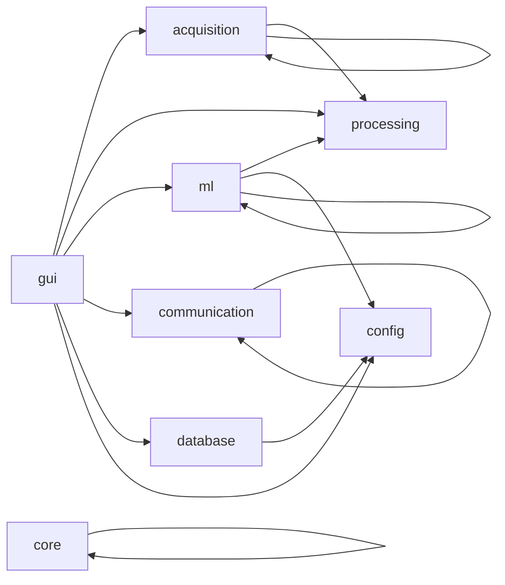

# BrainBridge v2 - Arquitetura AS-IS

Este documento descreve a arquitetura **como esta implementada hoje** no codigo.
Fonte principal: `brainbridge_v2/`.

## 1) Diagrama de Contexto (C4 - Nivel 1)

## 2) Diagrama de Containers (C4 - Nivel 2)

## 2.1) Diagrama de Deploy (execucao local)

## 3) Diagrama de Componentes (Runtime Principal)

## 3.1) Diagrama de Classes (simplificado)

## 4) Diagrama de Camadas (AS-IS vs ideal clean)

Leitura pratica:
- Existe separacao por pastas/modulos, mas a orquestracao esta concentrada no `StreamingWidget`.
- `core/*` existe como dominio, porem tem baixo uso no fluxo principal GUI.

## 5) Sequencia - Streaming e Gravacao

## 6) Sequencia - Modo Jogo (Predicao + Trigger Unity/ESP32)

## 7) Estado da Sessao Unity (implementacao atual)

Observacao:
- `SessionPhase` e `ServerState` existem no modulo, mas o controle efetivo de servidor ainda usa bastante `is_active` e `tcp_connected`.

## 8) Dependencias entre pacotes internos

Interpretacao:
- `gui` depende diretamente de quase tudo.
- Dependencia de `core` para regras de negocio no fluxo principal e baixa.

## 9) SOLID - Diagnostico objetivo (AS-IS)

| Principio | Estado atual | Evidencia no codigo | Impacto |
|---|---|---|---|
| S - Single Responsibility | Parcial / fraco em pontos criticos | `StreamingWidget` concentra UI, rede, log, inferencia, treino, protocolo | Alto acoplamento e manutencao dificil |
| O - Open/Closed | Parcial | Estrutura modular por pastas existe, mas extensoes exigem editar widgets centrais | Evolucao lenta sem quebrar fluxo |
| L - Liskov | Neutro | Pouca hierarquia/polimorfismo classico | Baixo impacto |
| I - Interface Segregation | Fraco | Nao ha interfaces pequenas para comunicacao, logger, inferencia | Componentes conhecem detalhes concretos |
| D - Dependency Inversion | Fraco no fluxo principal | GUI depende de classes concretas (`DatabaseManager`, `UnityCommunicator`, `ESP32...`) | Testabilidade e troca de adaptadores reduzidas |

## 10) Pontos fortes e riscos de arquitetura

### Pontos fortes
- Separacao fisica por modulos (`acquisition`, `ml`, `communication`, etc.).
- Fluxo end-to-end funcional no desktop (captura, grava, treina, prediz, envia trigger).
- Componentes de infraestrutura importantes ja isolados em arquivos proprios.

### Riscos principais
- `StreamingWidget` atua como "God Object" da aplicacao.
- Divergencia entre docs/testes e implementacao atual do estado de servidor Unity.
- `processing/preprocessing.py` referencia `.filters` que nao existe no pacote atual.
- Duplicidade de dialogos de treino (`gui/widgets/training.py` e `gui/dialogs/training_dialog.py`).
- Dominio (`core`) subutilizado na orquestracao principal.

## 11) Leitura final: "como o projeto esta hoje"

Arquitetura atual e **modular por pastas**, com **integracao funcional real**, mas com um **centro de gravidade excessivo na camada GUI** (especialmente `StreamingWidget`). O projeto esta numa fase entre "monolito modular" e "arquitetura em camadas de fato": os blocos existem, porem a inversao de dependencia e a distribuicao de responsabilidades ainda nao estao maduras.
